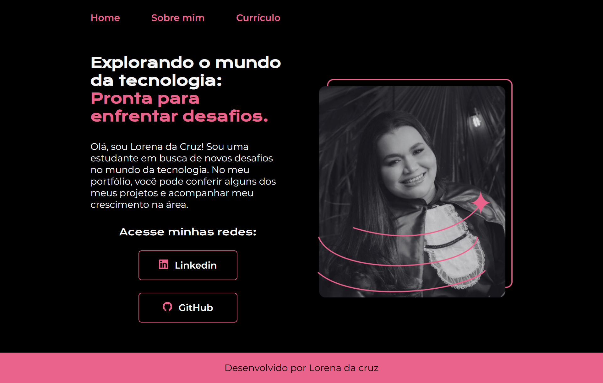

# Olá! 👋

Sou **Lorena da Cruz**, uma **Engenheira Agrônoma** que está em transição para o universo da tecnologia. Atualmente, estou cursando **Sistemas de Informação** (3º período), buscando uma nova jornada profissional que una a prática e o aprendizado contínuo. 💻✨

Com o desejo de crescer na área de TI, estou focada em transformar minha carreira e explorar novas possibilidades no desenvolvimento de software, focando sempre em inovação e colaboração.

---

Bem vindo ao meu projeto de portfólio, desenvolvido no curso de HTML e CSS da Alura.

---

🚀 **Acesse meu portfólio online:**  
🔗 [Meu portfólio na Vercel](https://seu-portfolio.vercel.app)

---

## 🛠️ Ferramentas utilizadas 🚧

## 📬 Contato

Estou sempre aberta para trocar ideias sobre **tecnologia**, **desenvolvimento de software**, ou até mesmo para conversar sobre **equilíbrio entre vida profissional e pessoal**! Vamos nos conectar:

- **LinkedIn**: [Conecte-se comigo no LinkedIn](https://www.linkedin.com/in/alorenadacruz/) 💼
- **Gmail**: [lorenacruz93@gmail.com](mailto:lorenacruz93@gmail.com) 📧

---

**[Perfil no GitHub](https://github.com/lorenadacruz)**  
*Última atualização: [18/02/2025]*

---
